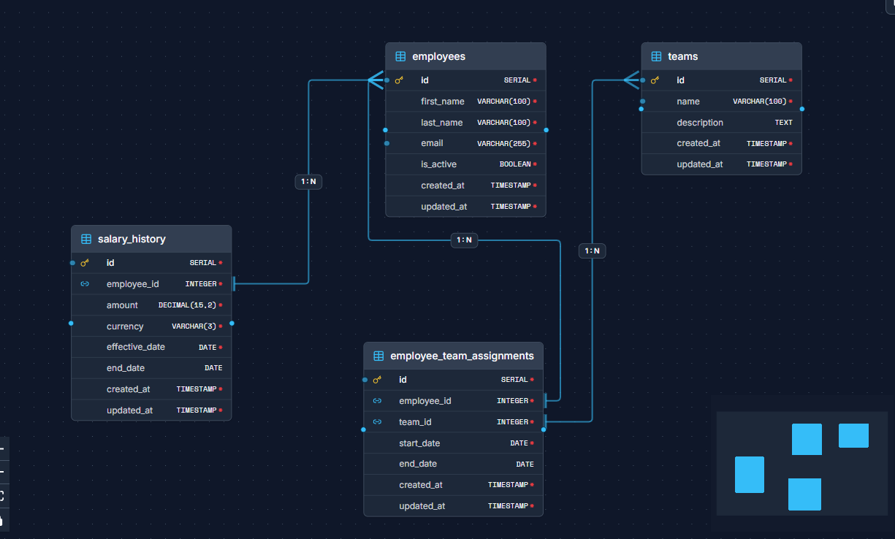

# Schema Versioning Demo

A practical demonstration of database schema versioning where the **diagram is the source of truth** and SQL, Docker, and documentation are generated from it.

This repository shows a workflow designed to avoid outdated database diagrams and broken documentation in real-world projects.

---

## The problem

Database diagrams usually become outdated.

They are created during the design phase, but as schemas evolve:
- hotfixes happen
- migrations accumulate
- delivery pressure increases

The code moves forward, but the diagram stays behind.

At some point, the ERD no longer represents production, and teams stop trusting it.

---

## The idea

Instead of maintaining documentation manually, this repository demonstrates a workflow where:

- A single model defines the database structure  
- SQL schemas are generated from that model  
- Docker environments are created automatically  
- Diagrams and documentation stay aligned  
- Everything is versioned and reviewable in GitHub  

No parallel artifacts. No stale documentation.

---

## Example schema

Below is the diagram used in the `ecommerce` example:



This diagram represents the **source model** from which all other artifacts were generated.

---

## Repository structure

```

examples/
└── ecommerce/
├── model/      # Source model (ForgeSQL export)
├── sql/        # Generated SQL (DDL and seed)
├── docker/     # Docker Compose environment
└── docs/       # Diagram image and design decisions

````

Each example is runnable and designed to be easy to review.

---

## Quick start (PostgreSQL)

Start the database locally using Docker:

```bash
cd examples/ecommerce/docker
docker compose up -d
````

Connection details:

* Host: localhost
* Port: 5432
* User: postgres
* Password: postgres
* Database: app

After startup, the schema and seed data are automatically applied.

---

## What each folder contains

* `model/`
  The original source model used to generate all artifacts.

* `sql/`
  Generated SQL files, including schema definition and seed data.

* `docker/`
  Docker Compose setup and initialization scripts.

* `docs/`
  Diagram export and a `decisions.md` file describing key modeling choices.

---

## Design goals

This repository focuses on:

* Keeping schemas and diagrams aligned with reality
* Making database structures easy to review in pull requests
* Treating the schema as a first-class, versioned artifact
* Reducing technical debt caused by outdated documentation

---

## How it was generated

The examples in this repository were generated from a single visual model using **ForgeSQL**:

[https://forgesql.com](https://forgesql.com)

The goal is not to promote a tool, but to demonstrate a workflow where:

* the model drives the implementation
* documentation does not depend on manual updates

---

## Who this is for

This repository is useful for:

* backend developers
* database engineers
* software architects
* teams dealing with schema evolution
* anyone frustrated with outdated ER diagrams

---

## License

MIT


